# CourtManager - Football Field Booking Management System

A production-grade, highly scalable backend API for managing football field bookings, built with **.NET 10**, **Clean Architecture**, and **CQRS (Command Query Responsibility Segregation) pattern** using **MediatR** and **EF Core Code-First**.

---

## 1. Project Overview & Business Purpose
**CourtManager** is a comprehensive platform designed to bridge the gap between sports facility owners and players. By digitizing the traditional process of booking football fields, the system minimizes scheduling conflicts, automates payment tracking, and provides a seamless communication channel between all parties.

* **For Field Owners (Managers)**: The platform allows you to register multiple venues (Venues), manage smaller sub-fields (FootballFields), configure amenities (Wifi, Parking, Water), and define available time slots with dynamic pricing. Owners can also track revenue, view upcoming bookings, and chat directly with customers to provide support.
* **For Players**: Players can search for nearby fields, view high-quality images and real reviews, apply discount codes, and book multiple time slots atomically to prevent double-booking. They can also pay online and accumulate loyalty points.
* **For Admins**: System administrators have global oversight over all users, venues, and transactions to ensure the platform operates smoothly.

---

## 2. Database Schema (Entities)

The system's data model is centered around Venues and Bookings. Below is the Entity-Relationship diagram illustrating the core relationships:

```mermaid
erDiagram
    %% =========================================================
    %% USERS - Tai khoan nguoi dung (customer / owner / admin)
    %% =========================================================
    USERS {
        uuid user_id PK
        string full_name
        string email UK
        string password
        string phone
        enum role "customer|owner|admin"
        string avatar_url
        int loyalty_points
        datetime created_at
        datetime updated_at
    }

    %% =========================================================
    %% VENUES - Cum san/khu san cua 1 owner (vd: "San bong A")
    %% =========================================================
    VENUES {
        uuid venue_id PK
        uuid owner_id FK
        string venue_name "San bong A"
        string address
        decimal latitude
        decimal longitude
        string description
        string opening_hours "06:00-23:00"
        string phone_contact
        boolean is_active
        datetime created_at
        datetime updated_at
    }

    %% =========================================================
    %% FOOTBALL_FIELDS - San con cu the trong venue
    %% =========================================================
    FOOTBALL_FIELDS {
        uuid field_id PK
        uuid venue_id FK
        string field_name "San so 1"
        enum field_type "5|7|11"
        decimal price_per_hour
        boolean is_active
        datetime created_at
        datetime updated_at
    }

    %% =========================================================
    %% VENUE_IMAGES - Anh cua cum san (carousel man chi tiet)
    %% =========================================================
    VENUE_IMAGES {
        uuid image_id PK
        uuid venue_id FK
        string image_url
        boolean is_primary
    }

    %% =========================================================
    %% AMENITIES - Danh muc tien ich (wifi, parking, shower...)
    %% =========================================================
    AMENITIES {
        uuid amenity_id PK
        string name
        string icon
    }

    %% =========================================================
    %% VENUE_AMENITIES - Bang noi many-to-many Venue - Amenity
    %% =========================================================
    VENUE_AMENITIES {
        uuid venue_id FK
        uuid amenity_id FK
    }

    %% =========================================================
    %% TIME_SLOTS - Khung gio cua tung san con (realtime status)
    %% =========================================================
    TIME_SLOTS {
        uuid slot_id PK
        uuid field_id FK
        datetime start_time
        datetime end_time
        decimal price
        enum slot_status "available|locked|booked"
        datetime locked_until
        datetime updated_at
    }

    %% =========================================================
    %% BOOKINGS - Don dat san (1 booking gom nhieu slot)
    %% =========================================================
    BOOKINGS {
        uuid booking_id PK
        uuid user_id FK
        decimal total_price
        decimal deposit_amount
        enum booking_status "pending|accepted|rejected|deposited|completed|cancelled"
        string note
        datetime created_at
        datetime updated_at
    }

    %% =========================================================
    %% BOOKING_ITEMS - Chi tiet tung slot trong booking
    %% =========================================================
    BOOKING_ITEMS {
        uuid booking_item_id PK
        uuid booking_id FK
        uuid slot_id FK
        decimal price
    }

    %% =========================================================
    %% PAYMENTS - Giao dich (deposit + final / 1 booking)
    %% =========================================================
    PAYMENTS {
        uuid payment_id PK
        uuid booking_id FK
        decimal amount
        enum payment_type "deposit|final"
        string payment_method "momo|vnpay|cash"
        enum payment_status "pending|success|failed|refunded"
        string transaction_code
        datetime paid_at
    }

    %% =========================================================
    %% CHAT_ROOMS - Phong chat 1-1 giua customer va owner
    %% =========================================================
    CHAT_ROOMS {
        uuid room_id PK
        uuid customer_id FK
        uuid host_id FK
        datetime last_message_at
        datetime created_at
    }

    %% =========================================================
    %% MESSAGES - Tin nhan trong room
    %% =========================================================
    MESSAGES {
        uuid message_id PK
        uuid room_id FK
        uuid sender_id FK
        string message_text
        boolean is_read
        datetime sent_at
    }

    %% =========================================================
    %% NOTIFICATIONS - Noi dung thong bao
    %% =========================================================
    NOTIFICATIONS {
        uuid notification_id PK
        string title
        string message
        enum type "booking|payment|chat|system|broadcast"
        string ref_id
        uuid sender_id FK
        datetime created_at
    }

    %% =========================================================
    %% NOTIFICATION_RECIPIENTS - Nguoi nhan
    %% =========================================================
    NOTIFICATION_RECIPIENTS {
        uuid recipient_id PK
        uuid notification_id FK
        uuid user_id FK
        boolean is_read
        datetime read_at
    }

    %% =========================================================
    %% REVIEWS - Danh gia cua user cho VENUE
    %% =========================================================
    REVIEWS {
        uuid review_id PK
        uuid user_id FK
        uuid venue_id FK
        uuid booking_id FK
        int rating "1-5"
        string comment
        datetime created_at
    }

    %% =========================================================
    %% DISCOUNTS - Ma giam gia (he thong / owner tao)
    %% =========================================================
    DISCOUNTS {
        uuid discount_id PK
        uuid owner_id FK
        uuid field_id FK "nullable - null = áp dụng mọi sân của owner"
        string code UK "vd: SUMMER2025"
        string name
        enum discount_type "percentage|fixed"
        decimal value "10 = 10% hoặc 50000đ"
        decimal min_booking_amount
        decimal max_discount_amount
        int usage_limit
        int used_count
        datetime start_date
        datetime end_date
        boolean is_active
        datetime created_at
    }

    %% =========================================================
    %% BOOKING_DISCOUNTS - Bang noi many-to-many Booking - Discount
    %% =========================================================
    BOOKING_DISCOUNTS {
        uuid booking_id FK
        uuid discount_id FK
        decimal discount_amount "tiền đã giảm thực tế"
    }

    %% =========================================================
    %% QUAN HE (RELATIONSHIPS)
    %% =========================================================
    
    %% USERS
    USERS ||--o{ VENUES : owns
    USERS ||--o{ BOOKINGS : makes
    USERS ||--o{ NOTIFICATION_RECIPIENTS : receives
    USERS ||--o{ REVIEWS : writes
    USERS ||--o{ CHAT_ROOMS : customer
    USERS ||--o{ CHAT_ROOMS : host
    USERS ||--o{ MESSAGES : sends
    USERS ||--o{ DISCOUNTS : creates

    %% VENUES & FIELDS & AMENITIES
    VENUES ||--o{ FOOTBALL_FIELDS : contains
    VENUES ||--o{ VENUE_IMAGES : has
    VENUES ||--o{ VENUE_AMENITIES : has
    VENUES ||--o{ REVIEWS : receives
    AMENITIES ||--o{ VENUE_AMENITIES : in
    
    FOOTBALL_FIELDS ||--o{ TIME_SLOTS : contains
    FOOTBALL_FIELDS |o--o{ DISCOUNTS : applies_to 

    %% BOOKINGS & TRANSACTIONS
    TIME_SLOTS ||--o{ BOOKING_ITEMS : reserved_in
    BOOKINGS ||--o{ BOOKING_ITEMS : contains
    BOOKINGS ||--o{ PAYMENTS : has
    BOOKINGS ||--o| REVIEWS : produces
    BOOKINGS ||--o{ BOOKING_DISCOUNTS : uses
    
    %% DISCOUNTS
    DISCOUNTS ||--o{ BOOKING_DISCOUNTS : applied_to
```



---

## 3. Technology Stack
* **Framework**: .NET 10 (C# 13), ASP.NET Core 10.0
* **Architecture**: Clean Architecture & CQRS (MediatR)
* **Database**: Microsoft SQL Server & Entity Framework Core 10.0 (Code-First)
* **Authentication**: ASP.NET Core Identity & JWT Bearer Tokens
* **Libraries**: AutoMapper, FluentValidation

---

## 4. Build and Run Instructions

### Prerequisites
* **.NET 10 SDK**
* **Local MS SQL Server** instance or LocalDB.

### Steps to Run
1. **Restore Dependencies**:
   ```bash
   dotnet restore
   ```
2. **Build Solution**:
   ```bash
   dotnet build
   ```
3. **Execute SQL Database Schema Migration**:
   ```bash
   dotnet ef database update --project CourtManager.Infrastructure --startup-project CourtManager.APIs
   ```
4. **Run Web API Hosting**:
   ```bash
   cd CourtManager.APIs
   dotnet run
   ```
5. **Interactive Testing via Swagger**:
   Open browser at `http://localhost:5000/swagger` or `https://localhost:7001/swagger`.

---

## 5. Seeding Data (For API Testing & Development)

The database includes pre-seeded accounts spanning all core system Roles. 

* **Uniform Login Password:** `Password@123`

### Seeded Profiles
| Role | Email Account | FullName | Phone Number |
|:---|:---|:---|:---|
| **Admin** | `lan.nguyen@courtmanager.vn` | Lan Nguyen | `0902311001` |
| **Manager** | `duy.pham@sporthub.vn` | Duy Pham | `0902311003` |
| **Player** | `andang.football@gmail.com` | An Dang | `0902311007` |

*(See `SampleDataSeeder.cs` for the full list of 12 seeded users).*
